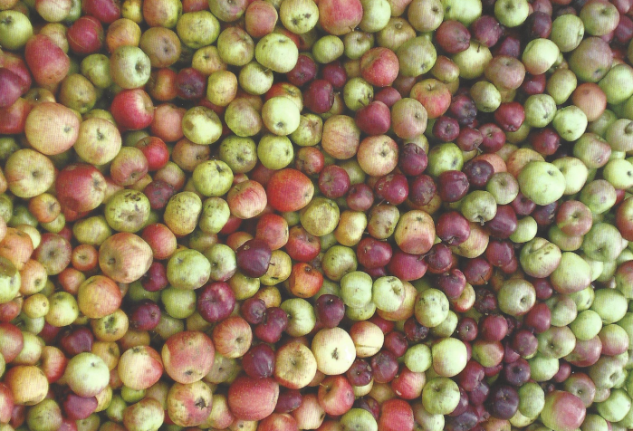

 
Streuobstwiesen sind eine immer größer werdende Bereicherung für die Umwelt, die Tierwelt und dem Menschen. Zum einen sind sie landschaftsästhetisch wirksam und prägen damit Hessen [1,3]. Ökologisch besitzen sie durch ihre hohe genetische Vielfalt einen besonders hohen Wert. Die hohe genetische Vielfalt wird nicht nur durch die Obstbäume geschaffen, sondern auch durch die Tierwelt, für die Streuobstwiesen einen wichtigen Lebensraum darstellen und auch als Biotopverbund dienen können [1]. Für den Verzehr bringen die vielen verschiedenen Sorten dementsprechend viele unterschiedliche Geschmacksrichtungen. Darüber hinaus enthalten sie Inhaltsstoffe, die zur Gesundheit beitragen und sogar das Risiko von Darmkrebs senken können [1,3].

Aber Streuobstwiesen sind gefährdet, weil das Interesse im 20. Jahrhunderts immer mehr abgenommen hat [1]. Aber auch die Anforderungen haben sich verändert durch die Wirtschaft, bei der Produktion, durch den Klimawandel und durch die Globalisierung. All dies hat zu einem Rückgang der genetischen Vielfalt geführt [3]. Seit dem Beginn dieses Jahrhunderts hat das Interesse aber wieder zugenommen [1]. Vereine wie der Pomologenverein oder der Verein Streuobstfreunde Marburg e.V. versuchen, jeweils insbesondere alte Obstsorten zu erhalten [3].

Die Streuobstfreunde Marburg verwalten unter anderem die Hessenwiese in Marburg-Michelbach. Auf dieser sind 113 Obstbäume von alten Obstsorten gepflanzt. Davon sind 102 Apfelbäume, vier Birnbäume, sechs Kirschbäume und ein Pflaumenbaum. Die Hessenwiese ist besonders da sie die Sortenvielfalt insbesondere von Äpfeln aus Hessen und nähere Umgebung darstellt. In Hessen ist speziell die Sortenvielfalt von Äpfeln besonders hoch [4]. Auf der Hessenwiese wird durch Büsche ein Umriss von Hessen dargestellt. Die Obstbäume wurden entsprechend ihrer Lage in Hessen an ihrem jeweiligen Standort auf der Hessenwiese gepflanzt.

Äpfel stammen ursprünglich aus den Gebirgen Zentralasiens und kamen mit der Völkerwanderung und später den Griechen und den Römern nach Deutschland. Auf den Weg entstanden durch Kreuzugen immer mehr lokale Sorten [3]. Heutzutage werden sie besonders als Tafeläpfel, d.h. zum Verzehr oder als Wirtschaftsäpfel, zur Weiterverarbeitung zu Saft, Apfelwein oder Apfelkuchen, verwendet [3]. Obstsorten von Streuobstwiesen landen aber nie im Supermarkt, weil sie nicht perfekt aussehen, nicht gleichmäßig rund sind und eine raue Schale haben, aber dafür viel mehr Vitamine, Mineralstoffe und Polyphenole besitzen [1]. Aufgrund der Vielfalt der Apfelsorten können für die Herstellung von Apfelwein besser geeignete Sorten verwendet werden, denn nicht jede Sorte ist gleich gut geeignet [2]. Außerdem haben verschiedene Sorten unterschiedliche Anforderungen. So können starkwüchsige und frostharte Sorten eher in hohen Lagen wachsen [2]. Spät blühende Sorten können zum Beispiel in Moor Regionen angebaut werden [2]. Ein Problem für Apfelbäume sind Krankheiten wie z.B. Schorf oder Krebs. Einige Sorten sind widerstandsfähiger gegen Krankheiten, andere weniger, so dass auch dies bei der Standortwahl berücksichtigt werden muss. Obstkrebs tritt z.B. vor allem bei nassen Böden auf [2].

Abb. 1: Ansammlung von Apfelsorten, nach Pomologenverein (2014)

Auf einer [interaktiven Karte](seegerkonstantin.github.io/genetische_vielfalt_lokal/2023/02/04/interaktive-map/) sollen nun die verschiedenen Apfelsorten auf der Hessenwiese kurz porträtiert werden, um deren Vielfalt darzustellen.

**Quellen:**   
[1] Natur & ēmwelt Hrsg. (2016): Äpfel und Birnen aus Luxemburg.   
[2] Pomologenverein Hrsg. (2014): Alte Obstsorten neu entdeckt.  
[3] Kahl, S. & R. Scheibel (2016): Erhaltenswerte Obstsorten für Hessen. 5.Auflage.   
[4] Hessisches Ministerium für Umwelt, Klimaschutz, Landwirtschaft und Verbraucherschutz (HMUKLV) (Hrsg.) (2022): Streuobstwiesen in Hessen - Heimat des Apfelweins – Zuhause für den Steinkauz. Wiesbaden.  
